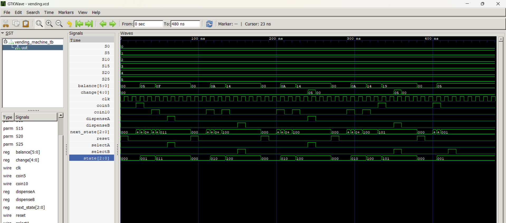

# FSM-Based Vending Machine Controller using Verilog HDL

## Overview
This project implements a Finite State Machine (FSM)-based vending machine controller using Verilog HDL.

The vending machine supports:
- Two products:
  - Product A = Rs.15
  - Product B = Rs.20
- Coin inputs:
  - Rs.5
  - Rs.10
- Change return functionality
- Exact and excess payment handling

---

## Features
- FSM-based sequential design
- Coin accumulation logic
- Product selection logic
- Change return mechanism
- Reset handling
- Functional verification using testbench
- Waveform analysis using GTKWave

---

## Tools Used
- Verilog HDL
- Icarus Verilog
- GTKWave
- VS Code

---

## Test Cases Verified
1. Product A exact payment
2. Product B exact payment
3. Product A with extra payment
4. Product B with extra payment
5. Insufficient balance handling

---

## Files
- `vending_machine.v` → Main FSM module
- `vending_machine_tb.v` → Testbench
- `vending.vcd` → Waveform dump file

---

## Simulation

### Compile
```bash
iverilog -o vending_out vending_machine.v vending_machine_tb.v
```

### Run
```bash
vvp vending_out
```

### Open Waveform
```bash
gtkwave vending.vcd
```

---

## Concepts Used
- FSM Design
- Sequential Logic
- State Transition Logic
- Testbench Verification
- Waveform Analysis
- Verilog HDL

## Waveform Output

